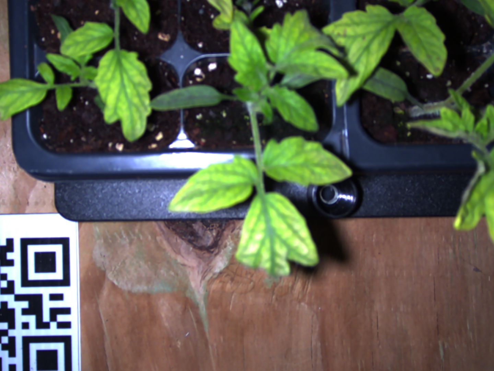
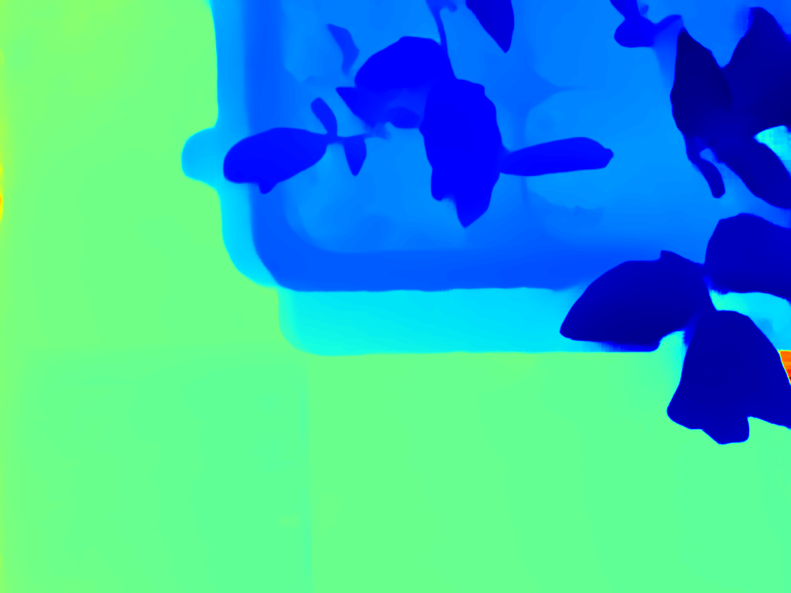
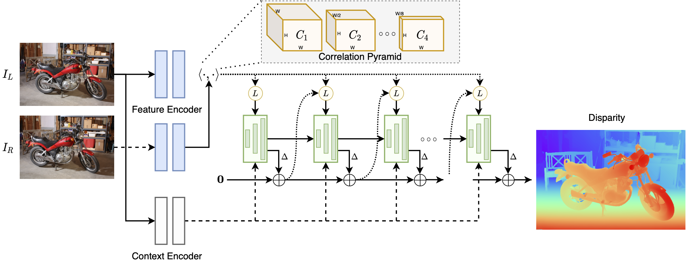

# RAFT-Stereo-TREX

An advanced deep learning-based stereo matching system for high-precision depth estimation and 3D scene reconstruction, built on the RAFT-Stereo architecture.

## Architecture Overview


```
[Stereo Pair] ─────┐
                   v
[Feature Extraction (Shared CNN Backbone)]
                   │
                   v
[4D Correlation Volume Computation]
                   │
                   v
[Recurrent GRU Refinement] ───┬──> [Disparity Maps]
                             ├──> [Depth Maps]
                             └──> [3D Point Clouds]
```

### Input: High-Resolution Stereo Image Pairs
<div style="display: flex; justify-content: space-between; align-items: center;">
  
  
</div>
<p align="center"><i>Rectified Stereo Image Pair</i></p>

### Dense Reconstruction Results

#### 1. Depth Maps
<div align="center">
  
  <p align="center"><i>High-Resolution Depth Map (blue = near-field, red = far-field)</i></p>
</div>

#### 2. Point Cloud Visualization
<div align="center">
  
  <p align="center"><i>Dense 3D Point Cloud Reconstruction</i></p>
</div>

## Technical Implementation

### 1. Deep Learning Architecture
- **Feature Extraction**:
  - Shared CNN backbone (ResNet-based)
  - Multi-scale feature pyramid (4 levels)
  - Instance normalization for robust feature encoding

- **Correlation Volume**:
  - 4D correlation computation with CUDA optimization
  - Multi-level correlation pyramid for hierarchical matching
  - Memory-efficient implementation for high-resolution processing

- **Iterative Refinement**:
  - Recurrent GRU updates (3-layer architecture)
  - Sub-pixel accuracy through soft argmax
  - Adaptive update steps based on scene complexity

### 2. Training & Evaluation

#### Datasets
- **SceneFlow**: Primary training dataset (FlyingThings3D, Driving, Monkaa)
- **KITTI**: Outdoor driving scenes
- **ETH3D**: Indoor/outdoor scenes
- **Middlebury**: High-resolution stereo pairs

#### Training Configuration
```bash
python train_stereo.py \
    --batch_size 6 \
    --train_iters 16 \
    --valid_iters 32 \
    --spatial_scale -0.2 0.4 \
    --n_downsample 2 \
    --mixed_precision \
    --num_steps 100000
```

#### Training Details
- **Optimizer**: AdamW (lr=0.0002, weight_decay=1e-5)
- **Learning Rate**: OneCycleLR scheduler
- **Loss Function**: Multi-scale sequence loss (gamma=0.9)
- **Validation**: Every 10000 steps
- **GPU Memory Optimization**: 
  - Mixed precision training
  - Gradient clipping at 1.0
  - Optional n_downsample=3 for reduced memory usage

### 3. Depth Computation Pipeline
- **Post-Processing**:
  ```python
  depth = (baseline * focal_length) / disparity
  ```
- **Precision Enhancements**:
  - Sub-pixel interpolation
  - Boundary refinement
  - Statistical outlier filtering

## Performance Metrics

1. **Accuracy**:
   - Sub-pixel disparity accuracy < 0.5px
   - Depth error < 1% at 10m range
   - Point cloud density > 90% on textured regions

2. **Processing Speed** (with NVIDIA RTX 3080):
   - 1080p stereo pair: ~100ms
   - Point cloud generation: ~50ms
   - Total pipeline latency: ~150ms

## Prerequisites

- CUDA-capable GPU (NVIDIA GTX 1080 or better)
- PyTorch 1.7+
- CUDA 10.2+ and cuDNN
- Python 3.7+

## Quick Start

1. **Installation**:
```bash
git clone https://github.com/Srecharan/RAFTStereo-TREX.git
cd RAFTStereo-TREX
conda env create -f environment.yaml
conda activate raftstereo
```

2. **Process Example Data**:
```bash
python scripts/process_static_stereo.py
```

## Output Formats

- **Raw Data**:
  - `depth*.npy`: Dense depth maps (float32)
  - `disparity*.npy`: Disparity maps
  - `temp_*.pcd`: Organized point clouds

- **Visualizations**:
  - `depth*.png`: Colored depth visualizations
  - `disparity*.png`: Disparity heat maps
  - Point cloud renderings (interactive)

## Citation

If you use this implementation, please cite:
```
@inproceedings{lipson2021raft,
  title={RAFT-Stereo: Multilevel Recurrent Field Transforms for Stereo Matching},
  author={Lipson, Lahav and Teed, Zachary and Deng, Jia},
  booktitle={International Conference on 3D Vision (3DV)},
  year={2021}
}
```


## License

MIT License - see [LICENSE](LICENSE) for details.

## Acknowledgments

Based on the [RAFT-Stereo](https://github.com/princeton-vl/RAFT-Stereo) implementation by Princeton Vision Lab.